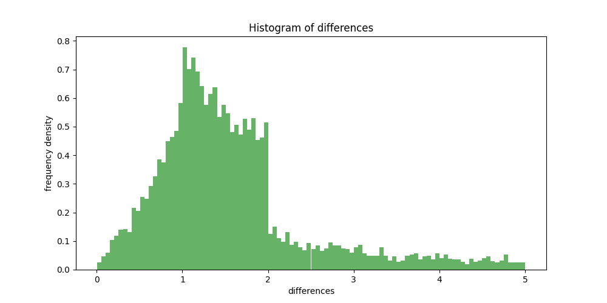

<h4>This repository shows the code and analysis for a time series analysis project </h4>

Timeseries: First two columns: the time series of the signal. So you can see that between times 0 and 0.182162 the signal was 0.0498... then it was 0.0638 until time 1.881267 etc...
The other column "Trade Timestamps" is a list of trades. So you can see the first trade happened at time 0.021807, the next trade at a time 11.46907. 
We think the signal might be linked to the arrival of trades, what do you think?

<h5>
My approach and ideas
</h5>

My general approach and methodology was to investigate the changes within the time series signal
around the trade timestamps. Graphically, this can be done by plotting the magnitude derivative of
the time series signal and the trade timestamps on the same plot. This would show the amount of changes
occuring to the signal around the trade timestamps. If the signal is linked to the arrival of trades, then
the magnitude derivative of the signal should be high around the trade timestamps. To increase the quality
of the time series signal, you can apply a moving average filter. This will smooth out the signal and
filter out high frequency noise.

<h5>
My implementation and results
</h5>

In order to retrieve meaningful values from the time series signal, I went and selected in groups of 3,
the values of the signal around the trade timestamps. Using this, I calculated an absolute center difference
between the values of the signal. This is the magnitude derivative of the signal. However, instead of raw
differences, I opted to calculate the relative change in the signal. This is more in line with a changing
stock price since the quantity can make up for differences of absolute price. Therefore the relative change
of price is more important.

I then plotted the relative changes of the signal in a historgram, to ascertain the distribution of the
relative changes. This is shown in the figure below.

As you can see, this histogram shows that the vast majority of the trade timestamps happen
when there is a relative change of over 1 in the signal. In addition to this, many large
relative changes were discarded due to the fact that they were outliers. 
This histogram suggests that there is a link between the signal and the arrival of trades.
More specifically that a strong change in the signal is linked to the arrival of trades.

<h5>
Evaluation and areas of improvement
</h5>

This approach is not perfect and there are many areas of improvement. Firstly, in this approach
filtering is mentioned but it is not applied. Filtering is important in time series signals to
remove noise. Ideally, you want a signal with a high SNR (signal to noise ratio). This is because
noise can obscure the signal and make it difficult to analyse. Secondly, it may be more accurate
to normalise the signal before processing it. This can allow a more accurate comparison between
values of change.

One thing to note is that this trade timestamps signal can be represented by a number of
Kronecker deltas at various times. Once you represent it as such, you can apply sophisticated
signal processing techniques directly between the two time series' and get a more accurate
analysis.

Finally, given more time and resources, a neural network can be developed which from the
time series signal can predict the trade timestamps. By excluding a validation and testing
set, you can evaluate its performance and see if it is a good predictor. This would be a
more sophisticated approach and would require more time and resources.

